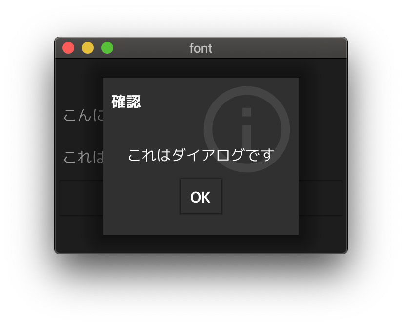

fyne-font-example
====


[Fyne](https://fyne.io) で日本語フォントを利用するサンプルアプリケーションです。

Sample application that uses different fonts in [Fyne](https://fyne.io).

> これは Fyne v2.x についての説明です. Fyne v1.x 以前のバージョンについて知りたい場合は [v1](./v1) 以下を参照してください.
>
> This is a description for Fyne v2.x. If you want to know for Fyne v1.x or earlier, please refer to the [v1](./v1) directory.



> Prefer to work with the GUI? Try the [fyne-theme-generator](https://github.com/lusingander/fyne-theme-generator)!

## Summary

#### 0. `fyne` コマンドをインストール / Install `fyne` command

```
$ go get fyne.io/fyne/v2/cmd/fyne

$ fyne
Usage: fyne [command] [parameters], where command is one of:
...
```

#### 1. フォントファイルを用意して `fyne bundle` コマンドを実行 / Prepare the font file and execute `fyne bundle` command

```
$ fyne bundle mplus-1c-regular.ttf > bundle.go

$ head -n 9 bundle.go
// auto-generated

package main

import "fyne.io/fyne/v2"

var resourceMplus1cRegularTtf = &fyne.StaticResource{
	StaticName: "mplus-1c-regular.ttf",
	StaticContent: []byte{
```

See [./v2/bundle.go](./v2/bundle.go).

> Warning: the file size is very large

#### 2. カスタムテーマを作成しフォントリソースを読み込む / Create the custom theme and load font resources

```go
type myTheme struct{}

func (*myTheme) Font(s fyne.TextStyle) fyne.Resource {
	if s.Monospace {
		return theme.DefaultTheme().Font(s)
	}
	if s.Bold {
		if s.Italic {
			return theme.DefaultTheme().Font(s)
		}
		return resourceMplus1cBoldTtf
	}
	if s.Italic {
		return theme.DefaultTheme().Font(s)
	}
	return resourceMplus1cRegularTtf
}
...
```

See [./v2/theme.go](./v2/theme.go).

#### 3. カスタムテーマを読み込む / Load the custom theme

```go
...
	a := app.New()
	a.Settings().SetTheme(&myTheme{})
...
```

See [./v2/main.go](./v2/main.go).

----

[M+ FONTS](http://mplus-fonts.osdn.jp/) is included and used as a sample font file.

http://mplus-fonts.osdn.jp/
