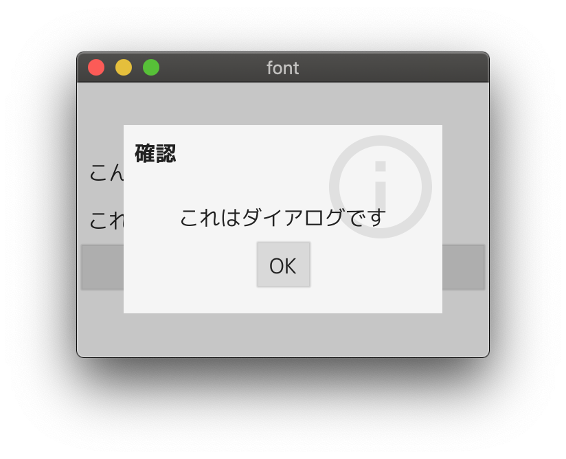

fyne-font-example
====



Fyne でフォントを扱うサンプルアプリケーション

`bundle.go` は [fyne command](https://github.com/fyne-io/fyne/tree/master/cmd/fyne) を利用して生成しています.

```
$ fyne bundle mplus-1c-regular.ttf > bundle.go
$ fyne bundle -append mplus-1c-bold.ttf >> bundle.go
```

詳細については以下の記事に記載しています.

- [`fyne` コマンドで各種リソースをバンドルする方法](https://lusingander.netlify.app/posts/200613-fyne-resourece/)
- [Fyne で日本語を扱う](https://lusingander.netlify.app/posts/200614-fyne-font/)

公式のチュートリアルにもリソースのバンドルについて追記されました.

- [Bundling resources | Develop using Fyne](https://developer.fyne.io/tutorial/bundle)

----

Sample application that uses different fonts in Fyne

`bundle.go` is generated using [fyne command](https://github.com/fyne-io/fyne/tree/master/cmd/fyne).

```
$ fyne bundle mplus-1c-regular.ttf > bundle.go
$ fyne bundle -append mplus-1c-bold.ttf >> bundle.go
```

See the Blog below for more information.

- [About the `fyne` command](https://lusingander.netlify.app/posts/200613-fyne-resourece/)
- [About fonts](https://lusingander.netlify.app/posts/200614-fyne-font/)

An official tutorial has also been added on resource bundling.

- [Bundling resources | Develop using Fyne](https://developer.fyne.io/tutorial/bundle)

----

[M+ FONTS](http://mplus-fonts.osdn.jp/) is included and used as a sample font file.

http://mplus-fonts.osdn.jp/
